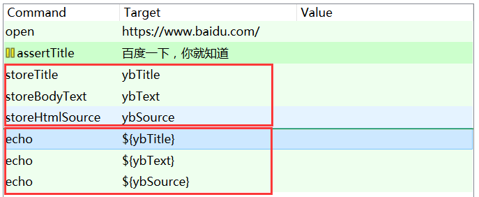

# Selenium IDE

该Selenium IDE主要应用于firefox浏览器  

## 1.工具准备

安装firebug，安装selenium IDE

## 2.基本录制   

### 1.校验内容    

1. 校验标题

```
assertTitle
selenium_百度搜索
```

2. 校验内容

```
verifyText
css=div.nums
*百度为您找到相关结果约*
```

​	*标识内容为通配    

也可以右键添加   

3. 等待加载

```
waitForTitle
selenium_百度搜索
```

​	防止加载没完执行错误验证    

4. 添加注释

   右键 Insert New Comment，在Source模式下也可以对标题等内容进行修改    

5. 保存测试文件

   右键save Test case，使用.html后缀    

6. 添加断点    

   右键Toggle Breakpoint，通过断点来调试自动化测试。    


[基础结构](../SourceCode/Hello.html)  

### 2.源码修改   

``<link rel="selenium.base" href="http://oa.minstone.com.cn/" />``

添加baseUrl，下面的操作路径就变得简短：

```
<td>/Login/enter.jsp;jsessionid=QTrhhMTJ3lnh1yyp8L9H5K9xnQ4GcT6d15zzKFZ5dKLb2t2KBTcw!1604708425</td>
```

## 3.命令   

#### 1.highlight   

changes the backgroundColor of the specified element yellow.  Useful for debugging.

#### 2.clickAndWait

If the click action causes a new page to load.

#### 3.verifyTitle   

验证标题：错误继续   

#### 4.assertTitle  

断言验证标题：错误停止

#### 5.verifyElementPresent   

验证元素存在与否    

## 4.变量   

#### 1.声明变量&打印变量   

   

点击的时候，可以把变量通过Value填进去。

[变量应用](../SourceCode/Variable.html)  

## 5.定位元素   


### 1.identifier   

identifier = loginFrom   ,identifier可以指定id、name。    

### 2.link定位  

``link=sample页面``   

### 3.增加过滤器

``name=continue value=Clear``   

 

### 4.其他定位   

#### 1.id定位   

#### 2.name定位     

#### 3.css样式   

组合css：``css=input.className[name='userName']``           


怎么移动内容？？

学习苦难的部分


